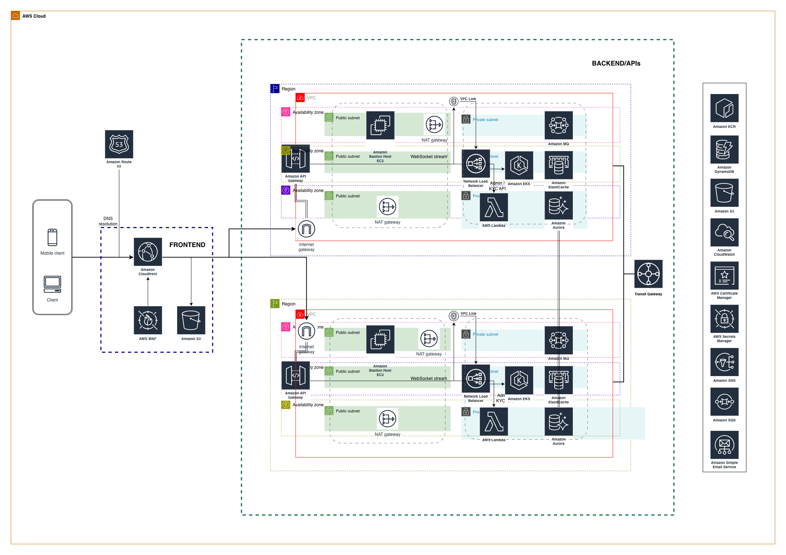

Provide your solution here:

# Overview Diagram — Services and Roles

  <strong>Figure 1. Highly Available Multi-Region Trading Platform Architecture on AWS</strong>

  

## Diagram Explanation

The diagram shows a highly available trading platform architecture built on AWS:

- **CloudFront + WAF + S3** serve and protect the frontend globally.
- **API Gateway** handles REST and WebSocket traffic and connects privately into the VPC using **VPC Link**.
- **NLB** forwards traffic internally to services running in **EKS** across multiple Availability Zones.
- **EKS microservices** implement authentication, orders, matching engine, wallet, and market data services.
- **ElastiCache (Redis)** stores the live order book and session cache for ultra-low latency access.
- **Aurora** stores persistent trading data such as orders, trades, and wallet ledger.
- **Amazon MQ** enables event-driven processing between order submission and the matching engine.
- **Lambda** handles asynchronous jobs like notifications and integrations.
- All backend components run in **private subnets**, with **NAT Gateway** for outbound access only.

# Elaboration on Why Each Cloud Service Is Used (and Alternatives Considered)

## Edge & Frontend Layer

### Amazon CloudFront + AWS WAF + Amazon S3

**Role in system**

- CloudFront serves the web/mobile static frontend globally with low latency.
- WAF protects against DDoS, bots, and common web attacks before traffic reaches the backend.
- S3 hosts static assets (SPA, images, scripts).

**Why used**

- Offloads a significant amount of traffic from backend services.
- Provides first security barrier.
- Global performance improvement.

**Alternatives considered**

| Alternative        | Why not chosen                           |
| ------------------ | ---------------------------------------- |
| ALB serving static | No edge caching, higher cost             |
| Self-hosted Nginx  | Ops overhead, no global POPs             |
| Cloudflare         | Extra vendor, not native IAM integration |

---

## API Entry Layer

### Amazon API Gateway (REST + WebSocket) with VPC Link

**Role in system**

- Single entry for REST trading APIs and WebSocket market streams.
- Integrates with authorizers for authentication, and enforces throttling and rate limiting per user.
- Connects privately into VPC using VPC Link.

**Why used**

- Native WebSocket support for real-time price feed.
- Fine-grained usage plans, which are critical to prevent trading abuse and API flooding.
- Keeps EKS completely private (no public ALB).

**Alternatives considered**

| Alternative          | Why not chosen                                   |
| -------------------- | ------------------------------------------------ |
| Public ALB + Ingress | Exposes cluster publicly, no per-user throttling |
| Nginx ingress only   | No API governance, harder scaling                |
| Kong/Apigee          | More ops complexity                              |

---

## Private Ingress to Kubernetes

### Elastic Load Balancing (Network Load Balancer) via VPC Link

**Role in system**

- Receives traffic from API Gateway VPC Link.
- Forwards to EKS services internally.

**Why used**

- Layer 4, ultra-low latency.
- Works perfectly with Kubernetes services.
- Private-only exposure.

**Alternatives**

| Alternative | Why not chosen                     |
| ----------- | ---------------------------------- |
| ALB         | Layer 7 not needed, higher latency |
| NodePort    | Not production grade               |

---

## Compute Layer

### Amazon EKS (multi-AZ)

**Role**

Hosts all microservices:

- auth-service
- order-service
- matching-engine
- wallet-service
- market-data
- settlement-service

**Why used**

- Well suited for running many independently scalable microservices.
- Supports HPA, node groups, and workload isolation.

**Alternatives**

| Alternative | Why not chosen                        |
| ----------- | ------------------------------------- |
| ECS         | Less control for complex service mesh |
| EC2 VMs     | No orchestration, poor scaling        |
| Lambda      | Not suitable for long-running engines |

---

## Caching & Real-time State

### Amazon ElastiCache (Redis cluster)

**Role**

- Holds live order book in memory.
- Session cache.
- Pub/Sub for WebSocket price broadcast.

**Why used**

- Microsecond latency.
- Native clustering and failover.
- Well suited for maintaining an in-memory order book with extremely low latency.

**Alternatives**

| Alternative      | Why not chosen          |
| ---------------- | ----------------------- |
| DynamoDB         | Too slow for order book |
| DB memory tables | Not scalable            |
| Hazelcast        | Extra ops overhead      |

---

## Database Layer

### Amazon Aurora (Multi-AZ, Multi-Region)

**Role**

- Orders history
- Trades
- Wallet ledger
- Users, KYC
- Cross-region data replication for disaster recovery and low-latency reads

**Why used**

- ACID compliance for financial transactions
- Automatic failover within region (Multi-AZ)
- Cross-region replication with very low replication lag suitable for trading data.
- Allows the system to evolve to active/active multi-region later without database redesign.

**Alternatives**

| Alternative          | Why not chosen                           |
| -------------------- | ---------------------------------------- |
| RDS MySQL            | No global replication                    |
| DynamoDB             | Not suitable for relational trading data |
| Single-region Aurora | Not resilient to regional outage         |

---

## Event & Messaging Layer

### Amazon MQ (Kafka-compatible messaging)

**Role**

- Orders written to queue.
- Matching engine consumes asynchronously.
- Event sourcing for rebuild capability.

**Why used**

- Decouples order submission from matching.
- Enables replay & recovery.

**Alternatives**

| Alternative         | Why not chosen                                             |
| ------------------- | ---------------------------------------------------------- |
| SQS                 | Lacks stream replay capability required for event sourcing |
| Direct service call | Tight coupling                                             |

---

## Async & Integration

### AWS Lambda

**Role**

- Notifications
- Webhooks
- Blockchain listeners for deposits

**Why used**

- Very cost-efficient for bursty, event-driven tasks that do not require always-on compute.

---

## Security & Secrets

### AWS Secrets Manager, IAM, private subnets, NAT

**Role**

- Secrets rotation.
- No public backend resources.
- Fine-grained IAM roles.

---

## Observability & Monitoring

### Amazon CloudWatch

**Role**

- Metrics, logs, and alarms for API latency, Redis memory usage, database connections, and EKS cluster health.

**Why used**

- Native integration with all AWS services
- Near real-time alarms for latency and resource spikes
- Centralized logs and metrics without additional agents

**Alternatives considered**

| Alternative          | Why not chosen                                      |
| -------------------- | --------------------------------------------------- |
| Prometheus + Grafana | Requires cluster management and storage operations  |
| Datadog              | Excellent SaaS observability but high cost at scale |

---

### AWS X-Ray

**Role**

- End-to-end tracing of order flow across microservices to detect latency sources.

**Why used**

- Native integration with API Gateway, Lambda, and EKS
- No additional infrastructure to operate

**Alternatives considered**

| Alternative                    | Why not chosen                           |
| ------------------------------ | ---------------------------------------- |
| Jaeger                         | Requires self-hosting and storage tuning |
| OpenTelemetry + vendor backend | Flexible but adds operational complexity |

---

### AWS CloudTrail

**Role**

- Full audit trail of API calls and operational access across the AWS account.

**Why used**

- Mandatory for security, compliance, and forensic analysis
- Immutable audit history

**Alternatives considered**

| Alternative      | Why not chosen                                                |
| ---------------- | ------------------------------------------------------------- |
| Third-party SIEM | Consumes CloudTrail logs but cannot replace CloudTrail itself |

---

## Operational Access (No Bastion)

### AWS Systems Manager Session Manager

**Role**

- Secure operational access to private EC2 instances and EKS worker nodes without SSH or public IP addresses.

**Why used**

- No key pair management
- Fully audited sessions
- Access occurs over the AWS control plane

**Alternatives considered**

| Alternative                | Why not chosen                                  |
| -------------------------- | ----------------------------------------------- |
| Bastion Host (jump server) | Adds attack surface and operational overhead    |
| VPN into VPC               | Extra network complexity and still requires SSH |

---

## CI/CD & Image Registry

### Amazon Elastic Container Registry

**Role**

- Store versioned Docker images for all microservices deployed to EKS.

**Why used**

- Native IAM authentication with EKS
- No dependency on external container registries
- High availability and durability

**Alternatives considered**

| Alternative       | Why not chosen                                  |
| ----------------- | ----------------------------------------------- |
| Docker Hub        | Rate limits and public internet dependency      |
| JFrog Artifactory | Powerful but unnecessary for container-only use |

---

### AWS CodePipeline

**Role**

- Automated build, test, and deployment pipeline to EKS using rolling or blue/green strategies.

**Why used**

- Fully managed CI/CD service
- Native integration with AWS services
- IAM-based security model

**Alternatives considered**

| Alternative    | Why not chosen                          |
| -------------- | --------------------------------------- |
| GitHub Actions | External to AWS IAM security boundary   |
| Jenkins        | Requires server maintenance and scaling |

---

### Architecture Principle

> No bastion host or public load balancer is used. All backend components remain private and are accessed securely through API Gateway and AWS Systems Manager Session Manager. This significantly reduces the attack surface while still allowing safe operational access.

---

## Plans for Scaling Beyond Current Setup

### Phase 1 — Initial Production (Current — as per diagram)

- 2 Regions deployed from day one
- Aurora Global Database (primary in Region A, secondary in Region B)
- 2 AZ per region
- Single Redis cluster per region
- EKS autoscaling based on CPU/RPS
- API Gateway regional endpoints

> At this stage, Region B is **warm standby** with live replicated data.

---

### Phase 2 — 10× User Growth

| Component   | Scaling action                    |
| ----------- | --------------------------------- |
| Redis       | Online resharding per region      |
| Aurora      | Add read replicas in both regions |
| EKS         | Separate node groups per service  |
| API Gateway | Increase throttling limits        |
| MQ          | Broker clustering                 |

Matching engine moved to compute-optimized nodes.

---

### Phase 3 — Active/Active Multi-Region

Because Aurora Global is already in place, the system can now:

- Promote Region B to serve live traffic
- Use **Amazon Route 53 latency routing**
- Users routed to nearest region
- Matching engines run in both regions
- Each region has its own Redis and MQ
- Trade data stays globally consistent via Aurora Global

**No database migration or redesign required.**

---

### Phase 4 — 100× Growth (Exchange level)

- Shard system by trading pair across regions
- Dedicated Redis per shard
- Replace MQ with Kafka-compatible streaming
- Isolate WebSocket service to its own nodes
- Read/write DB split pattern using regional readers

---

### Phase 5 — Extreme Scale (Binance-grade)

- Matching engine clusters per market
- Bare metal / Nitro instances for matching
- Global event streaming backbone
- Eventually consistent cross-region settlement

---

## Why Using Aurora Global From Day One Is Important

Most designs add multi-region later and require painful migration.

This design:

- Already survives **regional outage**
- Already supports **low-latency regional reads**
- Can switch to **active/active** by DNS change only
- Requires **zero database redesign** when scaling globally

This avoids a painful database migration when the system later needs to operate across multiple regions.
